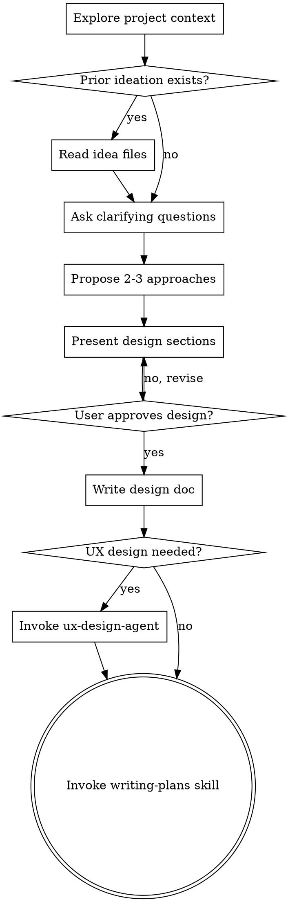

# Brainstorming Ideas Into Designs

## Overview

Help turn ideas into fully formed designs and specs through natural collaborative dialogue.

Start by understanding the current project context, then ask questions one at a time to refine the idea. Once you understand what you're building, present the design and get user approval.

<HARD-GATE>
Do NOT invoke any implementation skill, write any code, scaffold any project, or take any implementation action until you have presented a design and the user has approved it. This applies to EVERY project regardless of perceived simplicity.
</HARD-GATE>

## Anti-Pattern: "This Is Too Simple To Need A Design"

Every project goes through this process. A todo list, a single-function utility, a config change — all of them. "Simple" projects are where unexamined assumptions cause the most wasted work. The design can be short (a few sentences for truly simple projects), but you MUST present it and get approval.

## Checklist

You MUST create a task for each of these items and complete them in order:

1. **Explore project context** — check files, docs, recent commits
2. **Ask clarifying questions** — one at a time, understand purpose/constraints/success criteria
3. **Propose 2-3 approaches** — with trade-offs and your recommendation
4. **Present design** — in sections scaled to their complexity, get user approval after each section
5. **Write design doc** — save to `docs/plans/YYYY-MM-DD-<topic>-design.md` (local working directory, not committed)
6. **Evaluate UX design need** — if user-facing or agentic, recommend ux-design-agent
7. **Transition to implementation** — invoke writing-plans skill to create implementation plan

## Process Flow

**The terminal state is invoking writing-plans.** The only intermediate skill you may invoke is ux-design-agent (when UX design is needed). Do NOT invoke any other implementation skill.

## The Process

**Prior ideation:**
- If user references an idea file (`docs/*-idea-*.md`) or mentions prior ideation, read it
- Follow any `Related: [[...]]` links to gather context from connected ideas
- Use this context to skip or shorten discovery — the problem/opportunity is already captured

**Understanding the idea:**
- Check out the current project state first (files, docs, recent commits)
- If prior ideation exists, start from that context
- Ask questions one at a time to refine the idea
- Prefer multiple choice questions when possible, but open-ended is fine too
- Only one question per message - if a topic needs more exploration, break it into multiple questions
- Focus on understanding: purpose, constraints, success criteria

**Exploring approaches:**
- Propose 2-3 different approaches with trade-offs
- Present options conversationally with your recommendation and reasoning
- Lead with your recommended option and explain why

**Presenting the design:**
- Once you believe you understand what you're building, present the design
- Scale each section to its complexity: a few sentences if straightforward, up to 200-300 words if nuanced
- Ask after each section whether it looks right so far
- Cover: architecture, components, data flow, error handling, testing
- Be ready to go back and clarify if something doesn't make sense

## Evaluating UX Design Need

After validating the design direction, evaluate whether detailed UX design is needed:

**Recommend ux-design-agent when:**
- User-facing interface (GUI, CLI, voice)
- Agentic system (AI takes actions on user's behalf)
- User model isn't obvious ("who uses this and how?")
- Complex interaction flows (onboarding, wizards, multi-step)

**Skip to writing-plans when:**
- Internal tooling (user model is "us")
- Simple feature with obvious interaction
- Backend/infrastructure work

**Ask explicitly:**
> "This involves [user-facing interface / agentic behavior / complex interaction].
> Would you like detailed UX design (requirements, user model, modality selection)?
> Or proceed directly to implementation planning?"

**If yes:**
- **REQUIRED SUB-SKILL:** Use ux-design-agent
- ux-design-agent will produce structured requirements
- Then continue to writing-plans

**If no:**
- Proceed to writing-plans with current design document

## After the Design

**Documentation:**
- Write the validated design to `docs/plans/YYYY-MM-DD-<topic>-design.md` (local working directory, not committed)
- Use writing-clearly-and-concisely skill if available
- Paste the design into the PR body when you open it

**Implementation (if continuing):**
- Ask: "Ready to set up for implementation?"
- Use using-git-worktrees to create isolated workspace
- Use writing-plans to create detailed implementation plan

## Key Principles

- **One question at a time** - Don't overwhelm with multiple questions
- **Multiple choice preferred** - Easier to answer than open-ended when possible
- **YAGNI ruthlessly** - Remove unnecessary features from all designs
- **Explore alternatives** - Always propose 2-3 approaches before settling
- **Incremental validation** - Present design in sections, validate each
- **Be flexible** - Go back and clarify when something doesn't make sense
